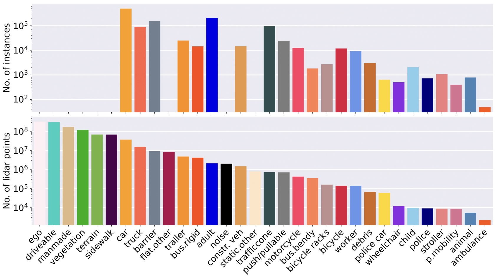
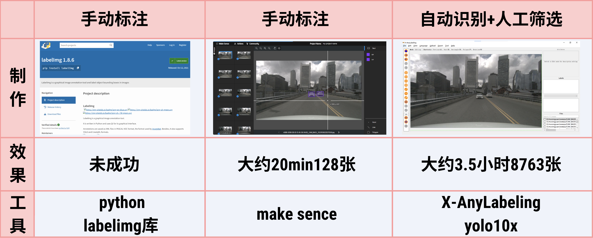
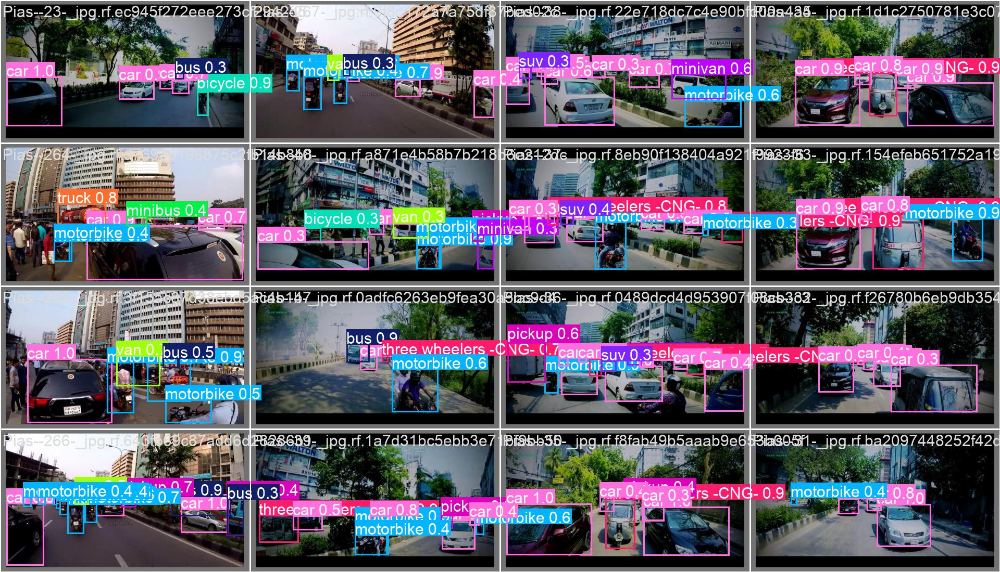
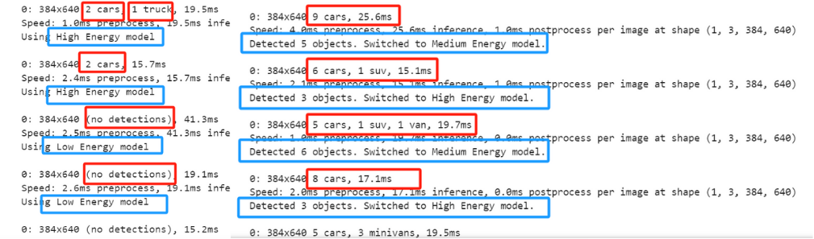

# Eco-Sight: 自动驾驶智能视觉感知

<p align="left">
    <picture>
        
    </picture>
</p>

**Eco-sight** 是一个自动驾驶的智能视觉感知系统。项目团队深入学习和实践了数据集的选择与制作、YOLO 模型的训练以及智能帧率调节，以确保在各种驾驶环境下实现快速而准确的目标检测。

## 目录
- [项目简介](#项目简介)
- [数据集选择与处理](#数据集选择与处理)
- [功能实现](#功能实现)
- [项目结果展示](#项目结果展示)
- [挑战与提升](#挑战与提升)
- [贡献者](#贡献者)

## 项目简介

随着新能源汽车在中国的快速普及，预计到 2025 年，新能源汽车的渗透率将趋于 40%。自动驾驶技术的发展对于推动这一转变至关重要。Eco-sight 项目通过采用深度学习和人工智能技术，提高了自动驾驶汽车的安全性和效率。

本项目积极响应“碳达峰碳中和”的国家战略，通过优化算法和提升能效，减少能源消耗，降低碳排放，为实现绿色低碳的智能交通系统做出贡献。

## 数据集选择与处理

本项目使用了多种自动驾驶数据集，并最终选择了 **nuScenes** 数据集。以下是数据集的分析对比：

| 数据集  | 优点 | 缺点 |
|---------|------|------|
| KITTI   | 历史悠久，数据多样 | 数据量小，场景单一，传感器技术较旧 |
| Waymo   | 数据量大，场景多样，传感器数据高质量 | 标注复杂，存在隐私和法律问题，获取限制 |
| nuScenes | 传感器数据全面，场景标注详细 | 数据量相对较小，标注一致性问题 |

**最终选择：nuScenes** 数据集，结合雷达云图与摄像机数据，通过预处理后获得了训练、验证和测试数据集。

<br><br>

<br><br>

### 数据预处理流程

- 原始数据：11,584 条
- 处理后数据：8,763 条
- 使用工具：`Python`、`labelimg` 库、`X-AnyLabeling`、`yolo10x`
- 预处理操作包括：手动标注和自动识别 + 人工筛选
  
<br><br>

<br><br>

## 功能实现

### 模型训练

模型基于 **YOLOv10** 进行训练，适应自动驾驶场景下的实时目标检测需求。训练过程包括：

- 数据集加载与清洗
- YOLO 模型参数优化
- 模型评估与迭代

### 智能帧率调节方法

智能帧率调节旨在通过动态调整模型的帧率和能耗模式，实现系统资源的高效利用。

- **核心逻辑**：根据目标物体数量调整使用的能耗模型（低、中、高）。
- **帧率调整**：
  - 无目标物体时：低能耗模式，节省资源
  - 目标物体 ≤ 3：高能耗模式，快速响应
  - 目标物体 ≥ 3：中等能耗模式，兼顾反应速度与准确性

## 项目结果展示

训练后的模型在多种场景下表现出色，尤其是在实时性和精度上的提升：

- **检测性能对比**：原模型 VS 训练后模型结果对比，展示了在多数情况下，训练后模型能够在不损失精确度的前提下识别更多种物体。

<br><br>

<br><br>

- **性能指标**：
  - 响应时间：平均20-25毫秒，达到行业标准性能。
  - 这一成就不仅展示了我们一定的专业能力，也为我们的技术在实时性和安全性要求极高的自动驾驶应用中提供了有力的支持。

<br><br>

<br><br>

## 挑战与提升

项目过程中遇到的主要挑战以及对应的提升方案：

1. **环境配置**：确保深度学习框架与硬件环境的兼容性，优化训练速度。
2. **训练日志与图表分析**：通过可视化的日志记录（在图表结果文件夹里），对模型训练过程中的性能变化进行分析和优化。

## 贡献者

- 许焕桦 (组长)
- 慕容元
- 钟子诚
- 刘桸泽
- 江创泓 (组长)

---

## How to Use

### Setup

```bash
# 1. Create and activate a virtual environment
python -m venv .venv
source .venv/bin/activate

# 2. Install dependencies
pip install -r requirements.txt

# 3. Download model weights (auto-downloaded by Ultralytics)
python -c "from ultralytics import YOLO; YOLO('yolov10n.pt'); YOLO('yolov10s.pt'); YOLO('yolov10m.pt')"
mkdir -p models && mv yolov10*.pt models/
```

### Run Inference (adaptive switching)

```bash
python -m eco_sight.cli run --video path/to/driving_video.mp4
```

The system detects persons and vehicles in each frame and dynamically switches between three YOLOv10 variants based on object count:

| Objects Detected | Model Used | Frame Rate |
|------------------|-----------|------------|
| 0 | yolov10n (Low Energy) | 5 FPS |
| 1–3 | yolov10m (High Energy) | 30 FPS |
| >3 | yolov10s (Medium Energy) | 5 FPS |

### Run Benchmarks

```bash
# Full evaluation suite (latency, power, accuracy)
python -m eco_sight.cli benchmark --video path/to/video.mp4 --output-dir results/

# Project M1 Pro results to target edge devices
python -m eco_sight.cli normalize --results-dir results/ --target all

# Generate evaluation report
python -m eco_sight.cli report --results-dir results/ --output report.md
```

---

## Benchmark Results

Measured on **Apple M1 Pro** (16-core GPU, MPS backend) with YOLOv10 base weights (COCO-pretrained) at 640×640 input.

### Accuracy (Model Quality)

Standalone model accuracy from 200-epoch fine-tuning on nuScenes-derived dataset:

| Model | mAP50 | mAP50-95 | Precision | Recall | Params |
|-------|-------|----------|-----------|--------|--------|
| yolov10n (nano) | 0.348 | 0.217 | 0.542 | 0.320 | 2.30M |
| yolov10s (small) | 0.451 | 0.265 | 0.625 | 0.408 | 7.25M |
| yolov10m (medium) | 0.508 | 0.299 | 0.570 | 0.473 | 15.36M |

Accuracy is hardware-independent — the same model weights produce identical results on any device.

### Speed / Latency (M1 Pro)

| Metric | nano | small | medium |
|--------|------|-------|--------|
| Inference latency (mean) | 71.6 ms | 148.7 ms | 156.5 ms |
| Inference latency (p95) | 75.1 ms | 165.7 ms | 166.4 ms |
| Effective FPS | ~14 | ~6.7 | ~6.4 |
| GFLOPs | 3.35 | 10.79 | 29.55 |
| Cold load time | 34 ms | 40 ms | 67 ms |
| First inference (warmup) | 89 ms | 178 ms | 221 ms |

**Model switching latency** (all models preloaded; switch cost = destination model's inference time):

| Switch Direction | Mean Latency |
|-----------------|-------------|
| nano → small | 150.8 ms |
| nano → medium | 158.6 ms |
| small → nano | 70.9 ms |
| small → medium | 155.9 ms |
| medium → nano | 70.3 ms |
| medium → small | 147.7 ms |

> Switching is effectively instant — no disk I/O, no model reload. The cost is just running inference with the new model.

### Projected Performance on Target Edge Devices

| Device | nano FPS | small FPS | medium FPS | Power |
|--------|----------|-----------|------------|-------|
| **M1 Pro (baseline)** | 14.0 | 6.7 | 6.4 | ~12W |
| Jetson Orin Nano (PyTorch) | 3.8 | 1.9 | 1.5 | ~10W |
| **Jetson Orin Nano (TensorRT)** | **27.9** | **13.5** | **9.1** | ~10W |
| Jetson Xavier NX (TensorRT) | 17.5 | 7.5 | 5.8 | ~12W |
| Intel NUC i5 (OpenVINO) | 7.0 | 3.0 | 2.5 | ~20W |
| Raspberry Pi 5 (CPU) | 0.7 | 0.3 | 0.3 | ~8W |

> Projections based on published YOLO benchmarks. TensorRT-optimized Jetson devices can outperform M1 Pro MPS for small models. RPi 5 is not viable for real-time adaptive switching.

### Power / Energy

On M1 Pro (10s test video, CodeCarbon estimates):

| Configuration | Runtime | Energy | CO2 |
|--------------|---------|--------|-----|
| nano-only (5 FPS) | 4.4s | 6.6×10⁻⁶ kWh | 3×10⁻⁸ kg |
| small-only (5 FPS) | 9.0s | 1.3×10⁻⁵ kWh | 5×10⁻⁸ kg |
| medium-only (30 FPS) | 1.7s | 3.3×10⁻⁶ kWh | 1×10⁻⁸ kg |
| **adaptive switching** | 4.5s | 6.8×10⁻⁶ kWh | 3×10⁻⁸ kg |

**Energy savings:** Adaptive switching reduces energy by ~9.5% vs fixed-model average. The 8.8× FLOPs difference between nano and medium means substantial savings when the system operates in low-energy mode.

### Key Takeaways

1. **Accuracy** (mAP50): medium > small > nano. The 0.16 mAP50 gap between nano and medium is significant — the switching policy must balance accuracy needs against energy.
2. **Speed**: On M1 Pro MPS, even nano only achieves 14 FPS due to ~55ms fixed overhead per inference call. On Jetson with TensorRT, nano achieves 28 FPS — near real-time.
3. **Power**: The adaptive policy saves energy proportional to time spent in nano mode. On a real driving video, savings would be higher when the scene is mostly empty.
4. **Switching cost** is negligible — just one inference call with the new model. No model reloading needed.
